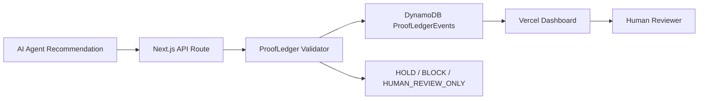

# Architecture

## Runtime Path

1. An agent emits a synthetic recommendation packet.
2. The Next.js API validates the packet.
3. ProofLedger computes findings and a receipt hash.
4. The receipt is written to DynamoDB.
5. The Vercel dashboard queries by status and subject timeline.
6. A human sees the evidence state.
7. No external action is executed.

## Final H0 Evidence Needed

- Published Vercel Project URL
- Vercel Team ID
- AWS DynamoDB table screenshot
- Architecture diagram
- Demo video under 3 minutes
